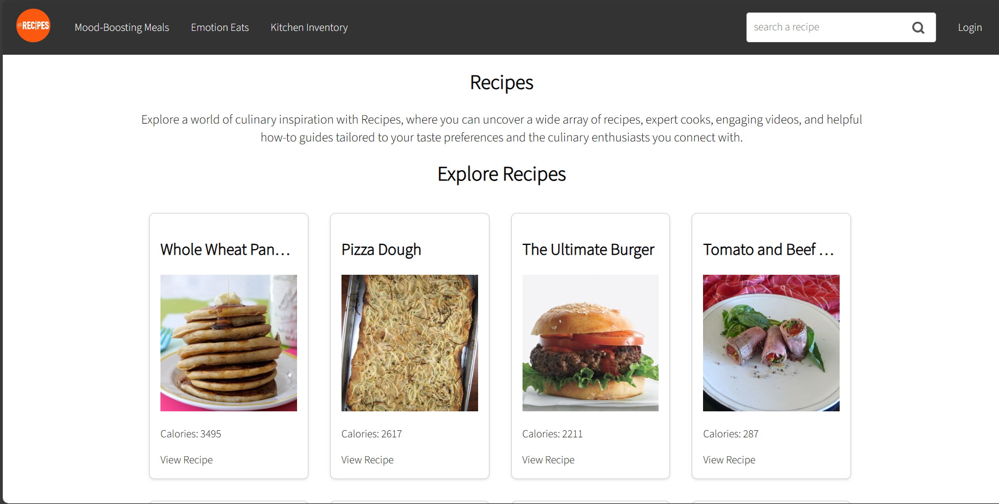

# RecipeApp

## Homepage


## Inhoudsopgave
- [Inleiding](#inleiding)
- [Functies](#functies)
- [Benodigdheden](#benodigdheden)
- [Installatie Stappen](#installatie-stappen)
  - [Eerste Methode](#eerste-methode)
  - [Tweede Methode](#tweede-methode)
- [Gebruik](#gebruik)
- [Standaard Gebruikers](#standaard-gebruikers)

## Inleiding
Deze applicatie is ontwikkeld met als doel je te helpen bij het dagelijkse dilemma van het kiezen van maaltijden en recepten. Het leven kan hectisch zijn, en het bedenken van wat je wilt eten kan een uitdaging zijn. Daarom heb ik deze app gemaakt om dit proces te vereenvoudigen en je te voorzien van suggesties op basis van verschillende criteria.
Deze documentatie zal je begeleiden bij de installatie van de app, de functies die het biedt, en hoe je het kunt gebruiken om het meeste uit je culinaire avonturen te halen
Volg de onderstaande stappen om de app te installeren, navigeer door de verschillende secties van deze documentatie en ontdek hoe de Recepten App je kan helpen bij het vinden van de perfecte maaltijd voor elke gelegenheid. Succes en eet smakelijk!

## Functies
- **User Registration and Login:** Gebruikers kunnen accounts aanmaken en veilig inloggen om gepersonaliseerde functies te gebruiken, zoals het aanpassen van profiel.
  
- **Receptsuggesties op basis van gemoedstoestand:** De app stelt gebruikers vragen gebaseerd op hun gemoedstoestand om recepten voor te stellen die aansluiten bij hun emotionele staat of voorkeuren op dat moment.

- **Zoeken naar Specifieke Recepten:** Gebruikers kunnen zoeken naar recepten op basis van specifieke criteria zoals gerechtnaam, of dieetvoorkeuren, waardoor het gemakkelijker wordt om gewenste recepten te vinden.

- **Recepten suggereren op basis van beschikbare ingrediënten:** Door beschikbare ingrediënten in te voeren, suggereert de app recepten die gebruikers kunnen bereiden zonder extra boodschappen te doen.

- **Profielupdate:** Gebruikers hebben de mogelijkheid om hun profielen bij te werken, informatie aan te passen.

- **Slechte dag modus voor troostmaaltijden:** In deze modus stelt de app troostende recepten voor die geschikt zijn voor een rotte dag en gerechten.

## Benodigdheden
- Node.js - Laatste versie
- npm - Wordt geïnstalleerd met Node.js
- Edamam API
- IDE - Visual Studio Code aanbevolen

## Installatie Stappen
### Eerste Methode
1. Kloon deze repository naar je lokale machine.
   ```bash
   git clone https://github.com/bayans/RecipeApp
2. Navigeer naar de projectdirectory.
   ```bash
   cd RecipeApp
3. Installeer de benodigde afhankelijkheden
   ```bash
   npm install
4. Ga naar de map RecipeApp/src/pages/Recipes.jsx en stel je Edamam API-gegevens in (deze zijn meegegeven in Verantwoordingsdocument):
   ```bash
   const API_ID = 'api_id';
   const API_KEY = 'api_key';
5. Start de app.
   ```bash
   npm start
### Tweede Methode
1. Download het ZIP-bestand van deze repository en pak het uit naar de gewenste map.
2. Open je terminal en navigeer naar de uitgepakte map.
3. Volg de stappen 3 tot en met 5 die hierboven zijn genoemd in "Eerste Methode".

## Gebruik
Na het lokaal draaien van de app, open je deze via je webbrowser op http://localhost:3000 (of een ander gespecificeerd poortnummer). Je wordt rechtstreeks doorgestuurd naar de startpagina.
### In de navigatiebalk:
1. Klik op Stemming-Verbeterende Maaltijden; als je een slechte dag hebt, krijg je recepten die je stemming verbeteren.
2. Klik op Emotie-Eten en beantwoord de vragen; je krijgt recepten op basis van je antwoorden.
3. Klik op Keukenvoorraad om beschikbare ingrediënten aan te geven. Druk op "Toevoegen" en vervolgens op "Indienen" wanneer je klaar bent. Na het indienen krijg je recepten op basis van de ingrediënten die je hebt gekozen. 
4. Typ in het zoekvak als je een specifiek recept wilt zoeken en druk op Enter of op het zoekpictogram. Je wordt doorgestuurd naar de receptenfilterpagina en krijgt recepten op basis van je zoekopdracht, met de mogelijkheid om geavanceerde filters toe te passen.
5. Klik op Inloggen als je wilt inloggen met een bestaand account of om te registreren.
6. Als je bent ingelogd, kun je op Profiel klikken om je gegevens bij te werken en vervolgens op Opslaan te klikken op de pagina Bewerk Profiel.
7. Klik op het app-logo om naar de startpagina te gaan.
## Standaard Gebruikers
Je kunt de applicatie gebruiken zonder in te loggen. Registratie en inloggen zijn alleen nodig om je profiel bij te werken. Omdat ik de Novi-backend gebruik, worden de aangemaakte gebruikers om de paar uur gewist. Je kunt het registratieformulier gebruiken om een nieuwe gebruiker aan te maken.